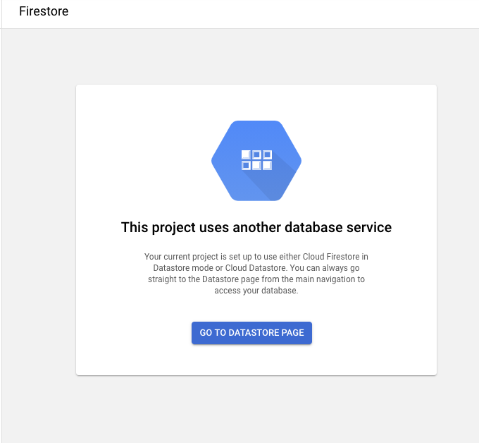
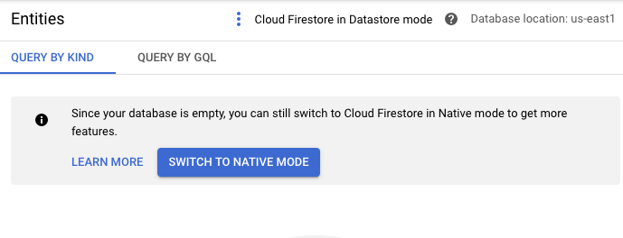
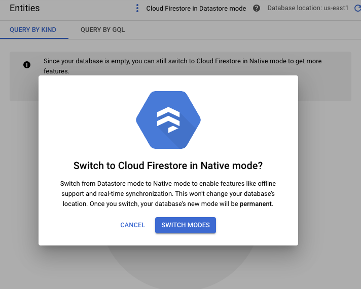

# Report2BQ

* Author: David Harcombe (davidharcombe@google.com)
* Type: Open source
* Status: Production

Report2BQ is a scalable, Cloud Functions-based solution to run and fetch
reports from CM and DV360, web-download format reports from SA360 and also
run ADH reports on a schedule.
The entire system has a simple install script, install scripts for setting
up fetchers or runners and a minimal amount of manual actions to be done.

## OVERVIEW

Report2BQ is a scalable, Cloud Functions-based solution to run and fetch
reports from CM and DV360, web-download format reports from SA360 and also
run ADH reports on a schedule.
The entire system has a simple install script, install scripts for setting
up fetchers or runners and a minimal amount of manual actions to be done.

## INSTALLATION GUIDE

### Prerequisites

* A GCP Project in which the current user has Admin access
* The latest version of the Google Cloud SDK and all dependencies, specifically
  the CLI tool
* A checked out copy of the GitHub repo

### Steps

**Setup the project**
1. Go to a command line \
Ensure you have the latest versions of the Google Cloud SDK, so run \
`gcloud components update` \
And allow it to update

1. Check out the code \
  `git clone https://github.com/google/report2bq`

**Before we start to install**

1. Now navigate to API & Services > Credentials

1. You will need an API key. Click "CREATE CREDENTIALS", and you will see this:  
  
Select "API Key"
Name: “Report2BQ API Key” 

**Install the application**

1. Run the installer \
`./install.sh --project=<PROJECT ID> --dataset=<DATASET NAME> --api-key=<API KEY> --create-service-account --activate-apis --deploy-all --dry-run` \
Project id comes from the GCP dashboard: \
 \
`--dry-run` simply shows what the code is _going_ to do, without actually doing anything.  
`<DATASET NAME>` default to `report2bq` if you don't choose your own.  
For detailed directions on what the installer can do, please see later or check out the script's own help with
`./installer.sh --help` \
**NOTE**: You can safely ignore any messages that say `ERROR: Failed to delete topic` at this point.

1. If you are prompted, type "y" to create an App Engine use the cloud scheduler, and choose a region  that makes
sense to you.

1. When the installer is finished (this will take a while, possibly as long as half an hour) go to the cloud console
in your browser, and go to Firestore (From the Cloud Console).

1. Set Firestore to "Native" mode. This **must** be done, and **cannot** be done programmatically

**Authentication**

1. Create the server's OAuth Id \
*(Note: You may need to "Configure Consent Screen" first. User type is likely "Internal", App name should be some variation on "`[Solution Name]` - Report2BQ"). User your email address for the email address fields. Don't worry about any non-required fields.)*\
1.1 Go to the API Credentials page and create new credentials. These should be of type
'Web Application'. \
 \
Now name it something sensible and memorable like 'Report2BQ oAuth Client Id'. \
Define the authorized redirect urls to be able to complete the OAuth flow.\
 \
Click "+ ADD URI"  and this screen will show up: \
 \
Paste in the `httpsTrigger` URL: `https:\\<PROJECT REGION>-<PROJECT ID>.cloudfunctions.net`,(e.g., `https://us-east1-my-rbq-project.cloudfunctions.net`) and click SAVE.

1. Download the Client ID JSON and save it to the tokens cloud storage bucket \
 \
Click on the download button to save the file. Now upload it to the token storage bucket in the
cloud, renaming it "client_secrets.json" as you go. You can do this through the web, or using the
CLI `gsutil` command like this: \
`gsutil cp <DOWNLOADED FILE> gs://<PROJECT ID>-report2bq-tokens/client_secrets.json`

1. Navigate to IAM > Identity Aware Proxy 'IAP'. (Enable it, if needed.)

1. Follow steps on [./appengine/README.md]() to install the App Engine project that will allow users to grant permission to Report2BQ to run on their behalf.

1. Once you have set up the App Engine project in the previous step, you can create the runners and fetchers for a given report.\
*See **[SETUP.md]()** for details on how to do this.*
