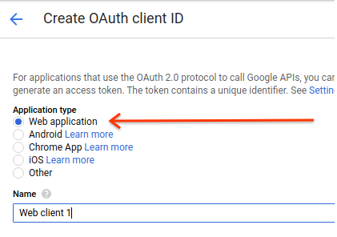
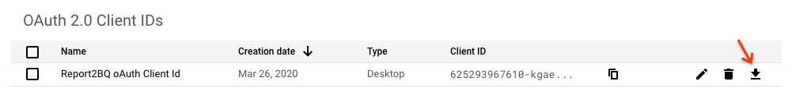
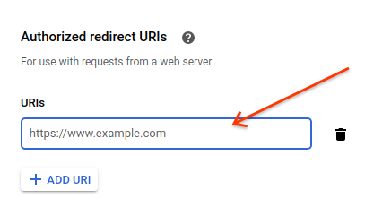

# Report2BQ

* Owning team: go/cse-dclk
* Mailing list: platforms-ase-emea@google.com
* Author: David Harcombe (who/davidharcombe)
* Docs: go/
* Type: Open source
* Status: Production

Report2BQ is a scalable, Cloud Functions-based solution to run and fetch
reports from CM and DV360, web-download format reports from SA360 and also
run ADH reports on a schedule.
The entire system has a simple install script, install scripts for setting
up fetchers or runners and a minimal amount of manual actions to be done.

## OVERVIEW

Report2BQ is a scalable, Cloud Functions-based solution to run and fetch
reports from CM and DV360, web-download format reports from SA360 and also
run ADH reports on a schedule.
The entire system has a simple install script, install scripts for setting
up fetchers or runners and a minimal amount of manual actions to be done.

## INSTALLATION GUIDE

### Prerequisites

* A GCP Project in which the current user has Admin access
* The latest version of the Google Cloud SDK and all dependencies, specifically
  the CLI tool
* A checked out copy of the GitHub repo

### Steps

1. Check out the code \
  `gcloud source repos clone report2bq --project=galvanic-card-234919`

1. Go to a command line \
Ensure you have the latest versions of the Google Cloud SDK, so run \
`gcloud components update` \
And allow it to update

1. Run the installer \
`./install.sh --project=<PROJECT_NAME> --dataset=<DATASET_NAME> --create-service-account --activate-apis --deploy-code --deploy-all --dry-run` \
Project id comes from the GCP dashboard: \
 \
`--dry-run` simply shows what the code is _going_ to do, without actually doing anything. 
For detailed directions on what the installer can do, please see later or check out the script's own help with
`./installer.sh --help` \
**NOTE**: You can safely ignore any messages that say `ERROR: Failed to delete topic` at this point.

1. If you are prompted, type "y" to create an App Engine use the cloud scheduler, and choose a region  that makes
sense to you.

1. When the installer is finished (this will take a while, possibly as long as half an hour) go to the cloud console
in your browser, and go to Firestore.

1. Set Firestore to "Native" mode. This **must** be done, and **cannot** be dome programatically

1. Go to API > Credentials

1. If you are planning to use ADH, you will need an API key. This is *ONLY* for ADH runners and is only needed
when you create the runner. It **can** be done safely later. \
Click “Restrict Key” \
Name: “Report2BQ ADH Key” \
API restrictions->Restrict key \
Choose “Ads Data Hub API” \
Click SAVE \


1. Update the OAuth consent screen \


1. Create the server's OAuth Id \
Go to the API Credentials page and create new credentials. These should be of type
'Web Application'. \
 \
Now name it something sensible and memorable like 'Report2BQ oAuth Client Id'.

1. Download the file and save it to the tokens bucket \
 \
Click on the download button to save the file. Now upload it to the token storage bucket in the
cloud, renaming it "client_secrets.json" as you go. You can do this through the web, or using the
CLI `gsutil` command like this: \
`gsutil cp <DOWNLOADED FILE> gs://<PROJECT ID>-report2bq-tokens/client_secrets.json`

1. The Final step: enable the OAuth flow \
At the command line, issue the following command:
`gcloud functions describe OAuthComplete --project=<PROJECT ID>`  \
This will go to the newly deployed cloud function and fetch the description. You need the 
line after `httpsTrigger:`, that starts `url:` \

```availableMemoryMb: 256
entryPoint: oauth_complete
httpsTrigger:
  url: https://<REGION>-<PROJECT ID>.cloudfunctions.net/OAuthComplete
ingressSettings: ALLOW_ALL
labels:
  deployment-tool: cli-gcloud
name: projects/<PROJECT ID>/locations/us-central1/functions/OAuthComplete
runtime: python37
serviceAccountEmail: <PROJECT ID>@appspot.gserviceaccount.com
sourceArchiveUrl: gs://<PROJECT ID>-report2bq/report2bq.zip
status: ACTIVE
timeout: 60s
updateTime: '2020-04-01T13:58:49.557Z'
versionId: '3'
```
Now go back to the OAuth client if you defined in steps 10 and 11, and click the edity button (looks like a pencil) \
 \
Click "+ ADD URI"  and this screen will show up: \
 \
Paste in the `httpsTrigger` URL, and click SAVE.


## DOCUMENTATION

* Tool link: go/
