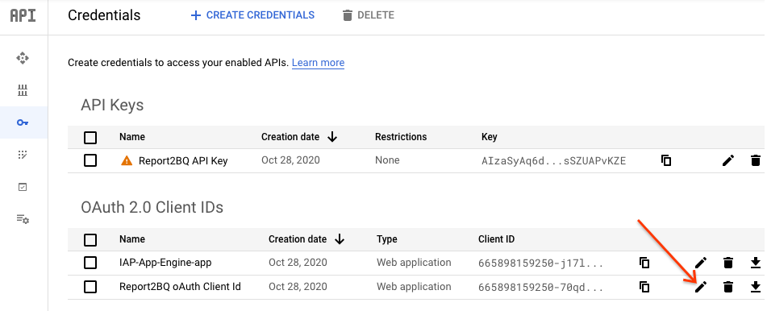

# Report2BQ Authentication and Administration Interface

* Author: David Harcombe (davidharcombe@google.com)
* Type: Open source
* Status: Production

Report2BQ is a scalable, Cloud Functions-based solution to run and fetch
reports from CM and DV360, web-download format reports from SA360 and also
run ADH reports on a schedule.
The entire system has a simple install script, install scripts for setting
up fetchers or runners and a minimal amount of manual actions to be done.

## INSTALLATION GUIDE

### Prerequisites

* A GCP Project in which the current user has Admin access
* The latest version of the Google Cloud SDK and all dependencies, specifically
  the CLI tool
* A checked out copy of the GitHub repo
* An active, valid API Key for the GCP project (steps #3 & #4 of the main installation guide)

### Steps

1. From the root of the cloned repository, change into the `appengine` subdirectory. 
This is where the Administration module is based.

1. Edit the `app.yaml` file in your favourite text editor.  
Modify line 5 (`API_KEY: ""`) and copy/paste the API key from the [Credentials](https://console.cloud.google.com/apis/credentials) page into the API KEY between the quotation marks.
 \
Save and exit.

**Create jobs**

1. Deploy the appengine instance:  
`gcloud app deploy --project <YOUR PROJECT>`  
When it finishes, it will show you something like this: \
```
Services to deploy:

descriptor:      [/home/davidharcombe/cse/report2bq/appengine/app.yaml]
source:          [/home/davidharcombe/cse/report2bq/appengine]
target project:  [<YOUR PROJECT>]
target service:  [default]
target version:  [20200706t104653]
target url:      [<YOUR APPENGINE URL>]


Do you want to continue (Y/n)?  

Beginning deployment of service [default]...
╔════════════════════════════════════════════════════════════╗
╠═ Uploading 21 files to Google Cloud Storage               ═╣
╚════════════════════════════════════════════════════════════╝
File upload done.
Updating service [default]...done.                                                                                                                                                                                
Setting traffic split for service [default]...done.                                                                                                                                                               
Deployed service [default] to [<YOUR APPENGINE URL>]
```

1. While this is deploying, we now want to secure the appengine server. So let's go do that.

1. Navigate to [IAM > Identity Aware Proxy 'IAP'](https://console.cloud.google.com/security/iap).
1. You should see the report2bq app under HTTPS resources, enable the IAP toggle. Click on the row to show
the panel to add members. Add the user/email list/domain to the role “IAP-Secured Web App users” to control
the users that can access the site.

1. Navigate to the IAM & Admin > Identity Aware Proxy section in the Google Cloud Console  


1. Activate the IAP (if it is not already active). This will take a couple of minutes - hopefully enough time for the appengine instance to have deployed successfully. If not, just let step #3 finish.  

1. **Bookmark the url of your app engine app** (listed in the "Published" column on the "Identity-Aware Proxy" page of the cloud console). You will need it in later steps and it is used to Auth users, including yourself.
1. You will probably need to configure the "OAuth consent screen", these are the steps:
   
   1. Go to API & Services

   1. *If you have not already created an [oAuth Consent Screen](https://console.cloud.google.com/apis/credentials/consent),
    set one up now (see instructions in [../README.md#Authentication](../README.md#Authentication)), otherwise edit the existing one by clicking "EDIT APP" next to the app name.
       * Under "Authorized domains",  add the url of your app engine app (Bookmarked from the [IAP](https://console.cloud.google.com/security/iap) page in a previous step.)

1. Ensure that IAP on "App Engine app" is switched on. The appengine uses IAP to ensure you can control who has access - and to get the logged in user's details.
 
1. Now lock it down. You do this by:

    - Selecting the `App Engine app` checkbox on the left to open the info panel.
    - Clicking the `Add member` button, and insert the user(s) (`davidharcombe@google.com` for example) or domains (`google.com`) you want to have access.
    - Selecting the role "Cloud IAP" > "IAP-secured Web App User".
    - Clicking `Save`  
    

1. Allow the newly deployed app engine access to complete the OAuth authentication.
   - Go back to [APIs & Services -> Credentials](https://console.cloud.google.com/apis/credentials/), and click Edit (pencil icon) to the right of "oAuth 2.0 Client IDs" > ""Report2BQ oAuth Client Id"
   
   - Add `<YOUR APPENGINE URL>` (bookmarked previously) to the 'Authorized Javascript Origins'.
   - Add `<YOUR APPENGINE URL>/oauth-complete` and `<YOUR APPENGINE URL>` to the 'Authorized Redirect URIs'.
   - Save

1. You have now completed setting up the *Report2BQ Authentication and Administration Interface*.