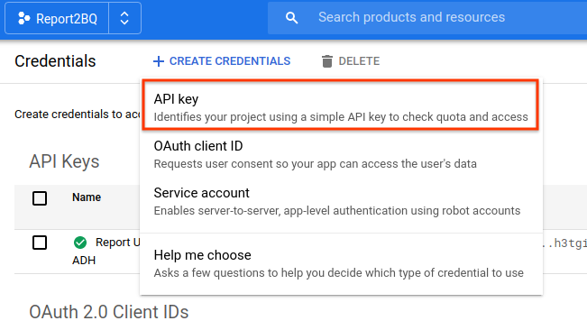
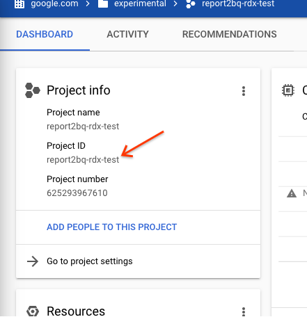
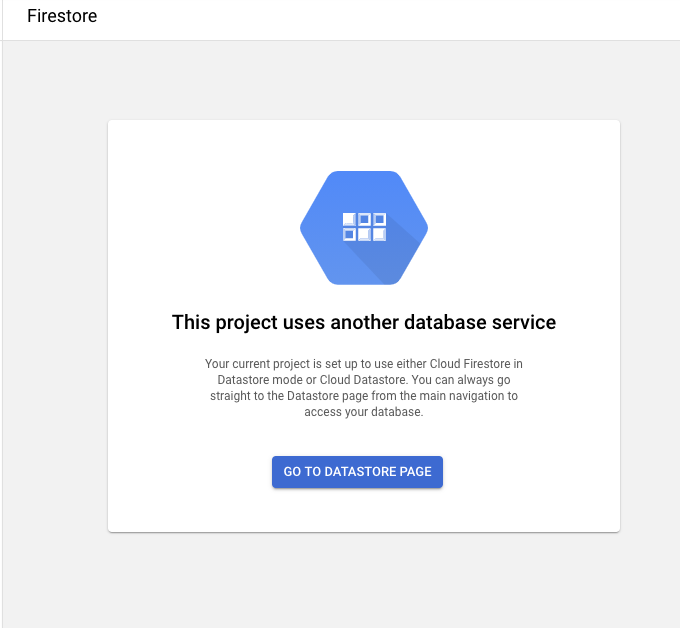
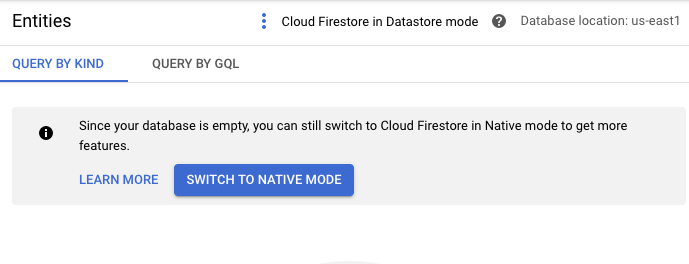
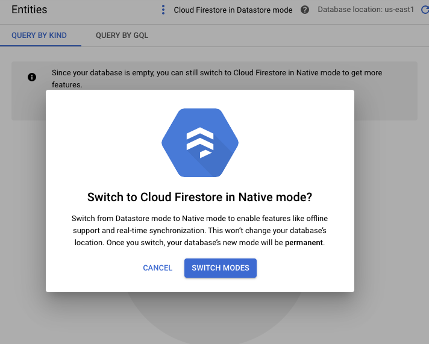
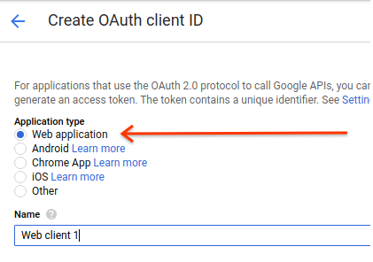
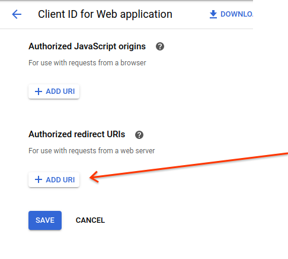
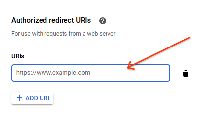
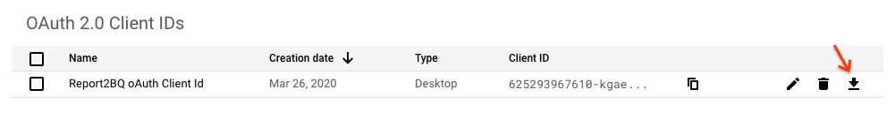

# Report2BQ

* Author: David Harcombe (davidharcombe@google.com)
* Type: Open source
* Status: Production

Report2BQ is a scalable, Cloud Functions-based solution to run and fetch
reports from CM and DV360, web-download format reports from SA360 and also
run ADH reports on a schedule.
The entire system has a simple install script, install scripts for setting
up fetchers or runners and a minimal amount of manual actions to be done.

## OVERVIEW

Report2BQ is a scalable, Cloud Functions-based solution to run and fetch
reports from CM and DV360, web-download format reports from SA360 and also
run ADH reports on a schedule.
The entire system has a simple install script, install scripts for setting
up fetchers or runners and a minimal amount of manual actions to be done.

## INSTALLATION GUIDE

### Prerequisites

* A GCP Project in which the current user has Admin access
* The latest version of the Google Cloud SDK and all dependencies, specifically
  the CLI tool
* A checked out copy of the GitHub repo

### Steps

#### Setup the project
1. Go to a command line \
Ensure you have the latest versions of the Google Cloud SDK, so run \
`gcloud components update` \
And allow it to update

1. Check out the code \
  `git clone https://github.com/google/report2bq`

#### Before we start to install

1. Navigate to [API & Services > Credentials](https://console.cloud.google.com/apis/credentials)

1. You will need an API key. Click "CREATE CREDENTIALS", and you will see this:

Select "API Key", set name to“Report2BQ API Key” \
Note the API Key's value, you will need it for the next step

#### Install the application

1. Run the installer \
`./install.sh --project=<PROJECT ID> --dataset=<DATASET NAME> --api-key=<API
KEY> --create-service-account --activate-apis --deploy-all`
   * _`<PROJECT ID>` comes from the [GCP dashboard](https://console.cloud.google.com/home/dashboard):_ \
 \
   * _`<DATASET NAME>` will default to `report2bq` if you don't choose your own._
   * _`<API KEY>`  is the value from the API Key you created in the previous step_ \
   * _`--dry-run` simply shows what the code is _going_ to do, without actually doing
 anything._  ] \
For detailed directions on what the installer can do, please see later or check
 out the script's own help with `./installer.sh --help` \
**NOTE**: You can safely ignore any messages that say `ERROR: Failed to delete topic` at this point.
1. If you are prompted, type "y" to create an App Engine use the cloud scheduler, and choose a region  that makes
sense to you. (***NOTE the region. You will need it in a few steps.)

1. Once the installer has finished (this may take up to half an hour), go to [Firestore](https://console.cloud.google.com/firestore/data).

1. Set Firestore to "Native" mode. This **must** be done, and **cannot** be done programmatically. \
\
\
\
\

#### Authentication

1. Create the server's OAuth Id \
*(Note: You may need to "[Configure Consent Screen](https://console.cloud.google.com/apis/credentials/consent)" first. User type is likely "Internal", App name should be some variation on "`[Solution Name]` - Report2BQ"). User your email address for the email address fields. Don't worry about any non-required fields.)*\
1.1 Go to _[API Credentials](https://console.cloud.google.com/apis/credentials) > +CREATE CREDENTIALS > OAuth client ID_ of type
'Web Application'. \
 \
Now name it something sensible and memorable like 'Report2BQ oAuth Client Id'. \
Define the authorized redirect urls to be able to complete the OAuth flow.\
 \
Click "+ ADD URI"  and this screen will show up: \
 \
Paste in the `httpsTrigger` URL: `https://<PROJECT REGION>-<PROJECT ID>.cloudfunctions.net`,(e.g., `https://us-east1-my-rbq-project.cloudfunctions.net`) and click SAVE.

1. Download the Client ID JSON from the [Credentials](https://console.cloud.google.com/apis/credentials) page.
1. Rename it to "client_secrets.json".
1. Save it [Cloud Storage](https://console.cloud.google.com/storage/browser) in the `<project id>-report2bq-tokens` bucket :\
 \
(This can also be done via the CLI `gsutil` command like this: \
`gsutil cp <DOWNLOADED FILE> gs://<PROJECT ID>-report2bq-tokens/client_secrets.json`
)
1. Follow steps on [./appengine/README.md](./appengine/README.md) to install the *Report2BQ Authentication and Administration Interface*, which allows users to grant permission to Report2BQ to run on their behalf.
1. You can now create runners and fetchers for a given report.\
(*See **[SETUP.md](SETUP.md)** for details on how to do this.*)
