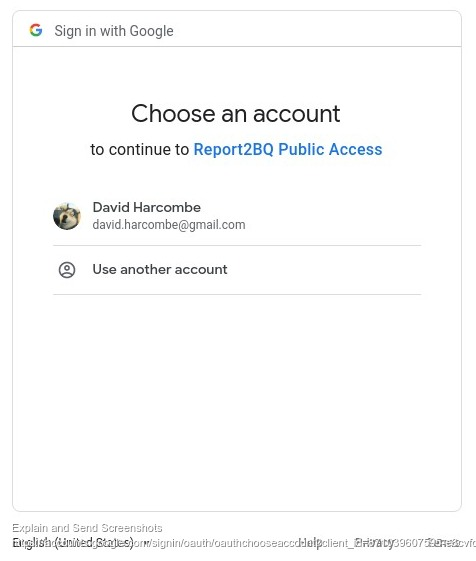
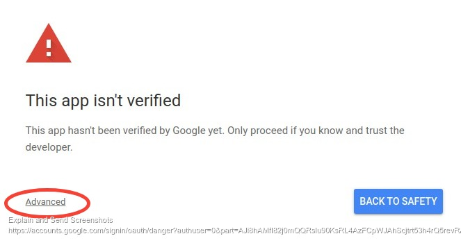
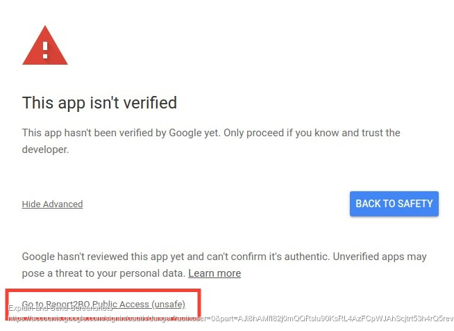
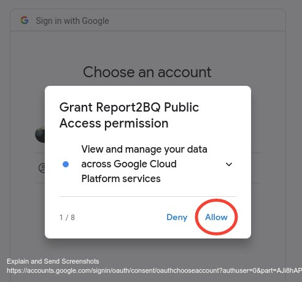

# BASIC SETUP

## User authorization
1. In a browser, go to your appengine app (which you should have bookmarked during setup`. *You should see this, or something similar:*


1. Select the email address

   1. If you get this prompt, do the following: \


   1. Click 'Advanced' to proceed to \

1. Then you will see prompts like this to permit access to various Google systems. *ALL ARE REQUIRED*,
so click 'Allow' for each one.

   - *It's ok if you get an "Internal Server Error" at the end.*
1. Congratulations! You are now authorized to create Report2BQ Runner and Fetcher jobs.

## Creating *fetcher* and *runner* jobs

### Prerequisites
* The latest Google Cloud command-line SDK installed
* All steps in [README.md](README.md) and [./appengine/README.md](./appengine/README.md) completed.
### Steps
1. Run `create_fetcher.sh` to see all the options:
```
create_fetcher.sh
=================

Usage:
  create_fetcher.sh [options]

Options:
  Common
  ------
    --project     GCP Project Id
    --email       Email address attached to the OAuth token stored in GCS
    --runner      Create a report runner rather than a report fetcher
    --dest-project
                  Destination GCP project (if different than "--project")
    --dest-dataset
                  Destination BQ dataset (if not 'report2bq')

  DV360/CM
  --------
    --report-id   Id of the DV360/CM report

  CM Only
  -------
    --profile     The Campaign Manager profle id under which the report is defined

  SA360 Web Download Report Only
  ------------------------------
    --sa360-url   The URL of the web download report in SA360. This will be in the format
                  https://searchads.google.com/ds/reports/download?ay=xxxxxxxxx&av=0&rid=000000&of=webquery

  SA360 Dynamic Report Only
  -------------------------
    --sa360-id    The UUID of the created SA360 report

  ADH Only
  --------
    --adh-customer
                  The ADH customer id (no dashes)
    --adh-query   The ADH Query Id
    --api-key     ADH API Key, created in the GCP Console
    --days        Days lookback for the ADH report. This defaults to 60.

  Other
  -----
    --force       Force the report to upload EVERY TIME rather than just when updates are detected
    --rebuild-schema
                  Force the report to redefine the schema by re-reading the CSV header. Use with care.
                  This is incompatible with 'append' since a schema change will cause a drop of the
                  original table. Should really not be placed in an hourly fetcher.
    --dry-run     Don't do anything, just print the commands you would otherwise run. Useful 
                  for testing.
    --append      Append to the existing table instead of overwriting
    --timer       Set the specific minute at which the job will run. Random if not specified.
    --hour        Set the specific hour at which the job will run. 
                  For a DV360/CM fetcher, this is '*', or 'every hour' at 'timer' minute and 
                  cannot be changed
                  For ADH this defaults to 2
                  For SA360 this defaults to 3
                  For report runners this defaults to 1
    --time-zone   Timezone for the job. Default is the value in /etc/timezone, or UTC if that file is
                  not present. If you type it manually, the value of this field must be a time zone
                  name from the TZ database (http://en.wikipedia.org/wiki/Tz_database)
    --description Plain text description for the scheduler list
    --infer-schema
                  [BETA] Guess the column types based on a sample of the report's first slice.
    --topic       [BETA] Topic to send a PubSub message to on completion of import job
    --message     [BETA] Message to send; this should be the name of the custom function to be
                  executed. Attributes of dataset, table name, report id and report type will always
                  be sent along with this as part of the message.
    --usage       Show this text

You must specify a report id or SA360 url.
```
3. Mandatory parameters are:
* `--project` - defines the target project for the job
* `--email` - defines the email address of the project owner  
  All other parameters vary according to the type of job being created

#### Creating a DV360 or CM `fetcher` to grab report results

##### Base command

* _DV360_  
`./create_fetcher.sh --project [PROJECT ID] --email [EMAIL ADDRESS] --report-id [REPORT ID] --description "A report description"`
* _CM_  
`./create_fetcher.sh --project [PROJECT ID] --email [EMAIL ADDRESS] --report-id [REPORT ID] --profile [PROFILE ID] --description "A report description"`

These will immediately create the jobs, but they will not start until the designated time. Each one will run at a random minute each hour, checking for a new report and uploading if one is found. This command will **REPLACE** all data in the big query table on each new report.

The `--description` is not strictly *mandatory*, but it's a really nice thing to do for your administrator otherwise the just have a list of jobs called `fetch-dv360-000000`, `fetch-cm-000000` etc with no indication of what each job is.

**Optional parameters (valid for either)**

* `--dest-project` / `--dest-dataset`
  * This specifies where the data should be written. The `email` user MUST have BQ write access.
* `--timer`
  * Set the minute at which the job runs. You shouldn't need to do this, it'll pick a random one.
* `--force`
  * Overwrite all the data in the table EVERY time, rather than just on a new report run being detected. You should not need this, but if you are potentially altering the data, it could be useful
* `--append`
  * Append the run to the existing BQ table instead of completely overwriting  
  This is useful if you run a report for (say) yesterday, but want to build up a history.  
  **WARNING:** it will replace NO data. None.

#### Creating a DV360 or CM `runner` to grab report results

##### Base command

* _DV360_  
`./create_fetcher.sh --project [PROJECT ID] --email [EMAIL ADDRESS] --report-id [REPORT ID] --runner --description "A report description"`
* _CM_  
`./create_fetcher.sh --project [PROJECT ID] --email [EMAIL ADDRESS] --report-id [REPORT ID] --runner --profile [PROFILE ID] --description "A report description"`

**Optional parameters (valid for either)**

* `--dest-project` / `--dest-dataset`
  * This specifies where the data should be written. The `email` user MUST have BQ write access.
* `--hour`
  * Set the hour at which the job runs. You shouldn't need to do this, by default it is 1am, in your local timezone. If you choose "*", it means EVERY HOUR.
* `--timer`
  * Set the minute at which the job runs. You shouldn't need to do this, it'll pick a random one.
* `--force`
  * Overwrite all the data in the table EVERY time, rather than just on a new report run being detected. You should not need this, but if you are potentially altering the data, it could be useful
* `--append`
  * Append the run to the existing BQ table instead of completely overwriting  
  This is useful if you run a report for (say) yesterday, but want to build up a history.  
  **WARNING:** it will replace NO data. None.

##### _Note on Error Notification Emails..._
* After setting up report fetchers/runners, you will start to receive
Error notification emails with the subject "*[REPORT2BQ on `<Project Id>`]: 
Error in Report Fetcher*". These emails can safely be ignored, unless
 they occur every hour (the job checker runs hourly).
